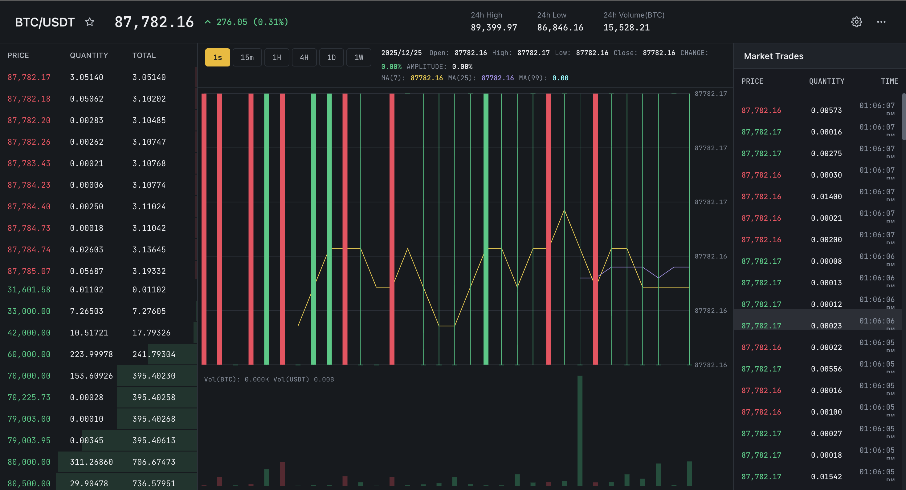
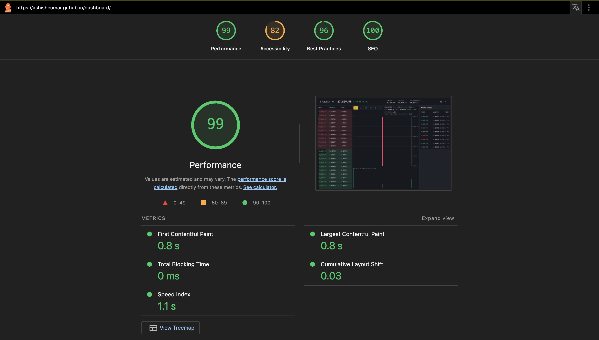

# 🚀 Binance - High-Performance Crypto Trading Dashboard

<div align="center">


**A professional-grade cryptocurrency trading interface built with React, TypeScript, and Web Workers for real-time market data visualization at 60 FPS.**

[Features](#-features) • [Tech Stack](#-tech-stack) • [Performance](#-performance) • [Getting Started](#-getting-started) • [Project Structure](#-project-structure)

### 🌐 Live Demo

**👉 [View Live Dashboard](https://pjain3797.github.io/hf-dashboard/)**

</div>

---

## 📸 Screenshots

### Dashboard Interface


*Real-time cryptocurrency trading dashboard showing BTC/USDT pair with live order book, candlestick chart, and market trades.*

### Performance Metrics


*Lighthouse performance report showing excellent scores: Performance 99, Best Practices 96, SEO 100, and Accessibility 82.*

---

## 📋 About

**Binance** is a high-performance cryptocurrency trading dashboard inspired by [Binance](https://www.binance.com/)'s professional trading interface. This project demonstrates advanced web performance optimization techniques, handling **200-500 trades per second** while maintaining a smooth **60 FPS** user experience.

### 🎯 Key Highlights

- ⚡ **Real-time Data Processing**: Web Workers handle all WebSocket data off the main thread
- 🎨 **Professional UI**: Dark-themed interface matching Binance's design language
- 📊 **Advanced Charting**: Interactive candlestick charts with moving averages and volume visualization
- 🔄 **Virtualized Lists**: Efficient rendering of thousands of trades using windowing
- 💾 **Memory Optimized**: Circular buffers prevent memory leaks during high-frequency updates
- ⏱️ **Optimized Web Vitals**: Skeleton loaders, code splitting, and performance optimizations

---

## ✨ Features

### 📈 Real-Time Market Data
- **Live Trade Stream**: Real-time trade ticker showing price, quantity, and timestamp
- **Order Book Depth**: Live order book with bid/ask visualization and depth bars
- **24h Statistics**: High, low, volume, and price change indicators

### 📊 Advanced Candlestick Chart
- **Multiple Timeframes**: 1s, 15m, 1H, 4H, 1D, 1W intervals
- **Moving Averages**: MA(7), MA(25), MA(99) with color-coded indicators
- **Volume Chart**: Integrated volume bars below price chart
- **Interactive Crosshair**: Hover to see price and time details
- **OHLC Display**: Open, High, Low, Close with change percentage and amplitude

### ⚡ Performance Optimizations
- **Web Workers**: All WebSocket processing happens off the main thread
- **Batching & Throttling**: 100ms batching prevents UI jank during high-frequency updates
- **Virtualization**: Only visible items are rendered (15-20 DOM nodes instead of 1000+)
- **Canvas Rendering**: Chart uses Canvas API for efficient drawing
- **Code Splitting**: Automatic chunk splitting for optimal bundle sizes
- **Skeleton Loaders**: Improved LCP and FCP with loading states

### 🎨 User Experience
- **Responsive Layout**: Three-panel layout (Order Book | Chart | Trades)
- **Dark Theme**: Professional dark color scheme
- **Monospaced Fonts**: JetBrains Mono for consistent number display
- **Smooth Animations**: 60 FPS maintained during data updates
- **Error Handling**: Graceful degradation and timeout handling

---

## 🛠️ Tech Stack

### Core Technologies
- **React 19.2** - UI framework with latest features
- **TypeScript 5.9** - Type-safe development
- **Vite 7.2** - Lightning-fast build tool and dev server
- **Jotai** - Atomic state management

### Performance Libraries
- **Web Workers** - Off-main-thread processing
- **Canvas API** - Efficient chart rendering
- **Virtualization** - Custom virtual list implementation

### Styling
- **CSS Variables** - Theme-based styling system
- **CSS Modules** - Component-scoped styles
- **Google Fonts** - JetBrains Mono for numbers

### Data Source
- **Binance WebSocket API** - Real-time market data streams

---

## 📁 Project Structure

```
dashboard/
├── src/
│   ├── atoms/              # Jotai state atoms
│   │   ├── trades.ts
│   │   └── orderBook.ts
│   ├── components/         # React components
│   │   ├── CandlestickChart/
│   │   ├── Header/
│   │   ├── MarketTrades/
│   │   ├── OrderBook/
│   │   ├── Skeleton/       # Loading skeletons
│   │   └── VirtualizedList/
│   ├── styles/             # Global styles
│   │   └── theme.css
│   ├── types/              # TypeScript types
│   │   └── types.ts
│   ├── utils/              # Utility functions
│   │   ├── constants.ts
│   │   └── helper.ts
│   ├── workers/            # Web Workers
│   │   └── websocket.worker.ts
│   ├── App.tsx
│   └── main.tsx
├── index.html
├── vite.config.ts
└── package.json
```

---

## ⚡ Performance

### Web Vitals Targets

- **LCP (Largest Contentful Paint)**: < 2.5s
- **FCP (First Contentful Paint)**: < 1.8s
- **FID (First Input Delay)**: < 100ms
- **CLS (Cumulative Layout Shift)**: < 0.1
- **TTFB (Time to First Byte)**: < 600ms

### Optimization Techniques

1. **Skeleton Loaders**: Immediate visual feedback while data loads
2. **Code Splitting**: Automatic vendor chunk splitting
3. **Web Workers**: Non-blocking data processing
4. **Virtualization**: Render only visible items
5. **Batching**: Group updates to prevent excessive re-renders
6. **Canvas API**: Efficient chart rendering
7. **DNS Prefetch**: Preconnect to Binance WebSocket servers
8. **Font Optimization**: `font-display: swap` for faster text rendering

### Performance Metrics

- ✅ **60 FPS** maintained during 500 trades/second
- ✅ **No Long Tasks** > 50ms
- ✅ **Stable Memory** usage (circular buffers prevent leaks)
- ✅ **Smooth Scrolling** in virtualized lists

---

## 🎨 Design Reference

This project's UI design is inspired by [Binance](https://www.binance.com/)'s professional trading interface. The layout, color scheme, and component structure follow Binance's design patterns while being built from scratch with modern web technologies.

### Color Palette

- **Background**: `#161A1E` (Dark grey)
- **Green (Bullish)**: `#0ECB81`
- **Red (Bearish)**: `#F6465D`
- **Yellow (Accent)**: `#FCD535`
- **Text Primary**: `#EAECEF`
- **Text Secondary**: `#B7BDC6`

---

## 📝 Development Notes

### Key Implementation Details

1. **Web Worker Architecture**: All WebSocket connections and data processing happen in a dedicated worker thread
2. **Batching Strategy**: Trades are collected for 100ms before being sent to the UI
3. **Circular Buffer**: Only the last 1,000 trades are kept in memory
4. **Virtual List**: Custom implementation that calculates visible range based on scroll position
5. **Canvas Rendering**: Chart uses 2D canvas context with device pixel ratio scaling


## 📄 License

This project is developed for educational and demonstration purposes.

---

## 👨‍💻 Developer

**Developed by** [Ashish]

This project demonstrates advanced React performance optimization techniques and real-time data handling capabilities.

- [Binance](https://www.binance.com/) - Design inspiration and WebSocket API
- [React](https://react.dev/) - UI framework
- [Vite](https://vitejs.dev/) - Build tool
- [Jotai](https://jotai.org/) - State management

---

<div align="center">

**Built with ❤️ using React, TypeScript, and Web Workers**

[⬆ Back to Top](#-Binance---high-performance-crypto-trading-dashboard)

</div>
